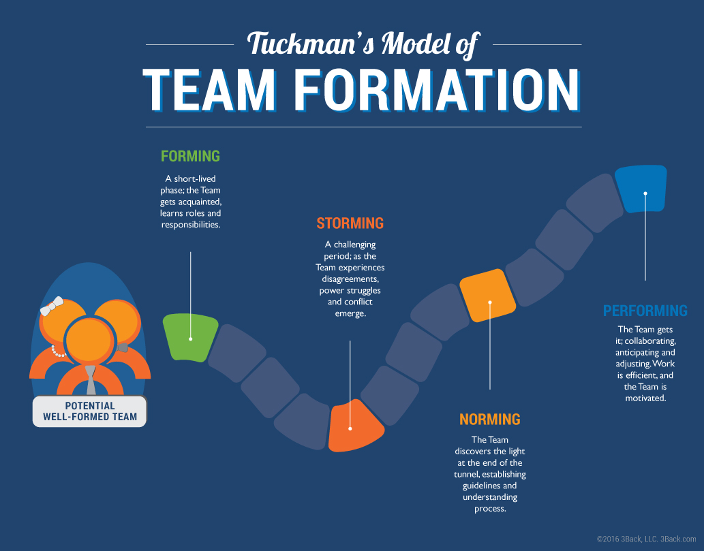

## What's a `README`?
A personal readme is a document outlining how you do your best work. It should articulate how you like to work, collaborate, communicate, receive feedback, etc.

## Cool, but why?
It stands as a guide for those of us who want to work with you on what the most effective way to do that is. Not only does it help others understand how best to work with you, but in writing [my own](/blog/working-with-me/) I've found it helps you understand yourself just one percent better.

## Speed from Forming to Performing
Forming, according to psychologist [Bruce Tuckman](https://en.wikipedia.org/wiki/Bruce_Tuckman), is the first stage of team development. This is where teammates are introduced but the group dynamic remains yet unknown.

Source: https://arr5n8wn3e-flywheel.netdna-ssl.com/

We all have different working styles and different ways of understanding each other. Creating a personal `README` is one way to start off a relationship on strong footing it decreases the time in the Storming phase of building up your team when you can easily understand where personality difference might arise before running into them yourselves.

